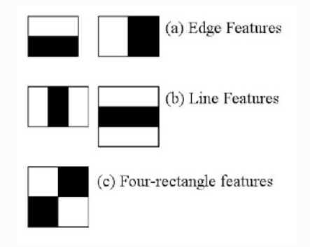
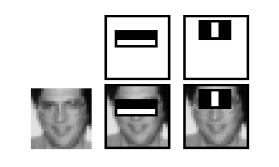
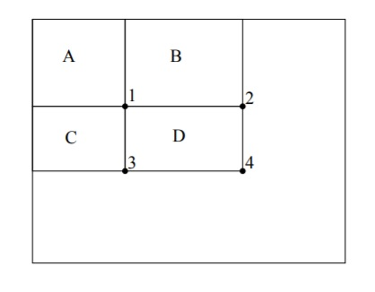
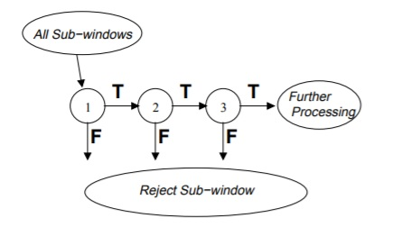

# Real time face detection

## Content:

* Demo
* Introduction.
* Haar Feature Selection.
* Integral Images.
* Adaboost Training.
* Cascading Classifiers.
* Detecting and tracking faces.

## Demo:
Video link : <a href="https://www.youtube.com/watch?v=bIhstUACwVg" target="_blank">youtube video</a>

## Introduction:
- Face Detection using Haar Cascades:
Haar feature-based cascade classifiers is a machine learning technique proposed by PaulViola and Michael Jones in their paper in 2001 known as Viola-Jones face detector, The algorithm train the classifier with a lot of images which contain face images (positive images) and non face images (negative images)

The original paper https://www.cs.cmu.edu/~efros/courses/LBMV07/Papers/viola-cvpr-01.pdf

- The algorithm divided into 4 steps:
1- Haar Feature Selection.
2- Integral Images.
3- Adaboost Training.
4- Cascading Classifiers.

## Haar Feature Selection:
Harr features uses extraction of common features by measuring the difference of intensity betwen regions this is some how looks like convolutional kernel.

We apply each rectangle as convolutional kernel over whole image to extract features, so simple 24 by 24 images will result of over 160,000 features which is computionally impossible for live face detection which could be solved using integral images and Adaboost as we will see later in this article.

rectangle feature = sum of pixels in black area - sum of pixels in whaite area

In this example we measure the intensity between the region of eyes and region of cheeks. The feature is computed by simply summing the pixels in the black area and subtracting the pixels in the white area.

## Integral Image:
Integral image is used to avoid us the too much computation to calculate the sum of any rectangle feature so instead of going through all the elements in the rectangular area, The rectangle features can be computed very rapidly using an intermediate representation for the image which is the integral image. Simply the integral image at location x,y contains the sum of pixels above and to the left of x,y inclusive  i(x,y) = sum (xdash,ydash)
                    xdash<=x,ydash<=y

for more dtails check below link:
https://www.cs.cmu.edu/~efros/courses/LBMV07/Papers/viola-cvpr-01.pdf

The value of the integral image at location 1 = A, the value at location 2 is A+B, at location 3 is A+c and at location 4 is A+B+C+D and the sum of D can be computed as (4+1) - (2+3)

## Adaboost training:
Adaboost learning algorithm is used to boost classification performance, Adaboost is used both to select small set of features and train the classifier with the best features that classify the image with minimum error.

We a[[ly each feature on all the training images and find the best threshold that will classify the image as positive and negative and then select features with minimum error these ofcourse will take several rounds until reach desired accuracy or error rate is achived at the end each trained classifier of these features are called weak classifier whicj are combined together to form the strong classifier that can classify the image.

Learning results from proposed paper that a  a frontal face classifier constructed from 200 features yields
a detection rate of 95% with a false positive rate 

## Cascading Classifiers
It's an algorithm for constructing a cascade of classifiers which achieves increased detection performance while reducing computation time, The key point is the smaller the more efficient classifier that instead of applying all selcted features, group the features into different stages of classifiers and apply one by one if a window fails it is rejected and apply the second stage of features while the window that passes all stages is a face region.

## Detecting and tracking faces:
Luckily OpenCV provides a face detection framework that we just need to load the cascade file and start using it so lets start coding.

